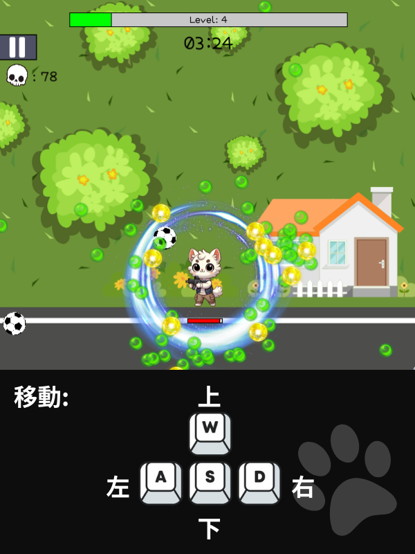
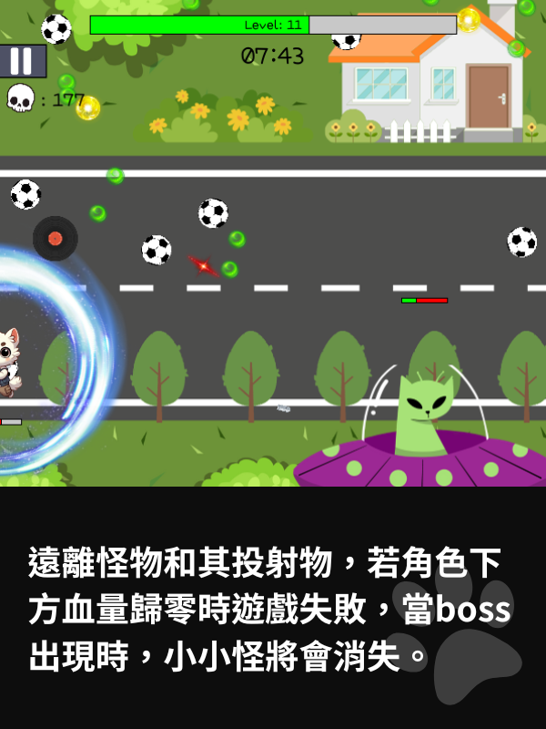
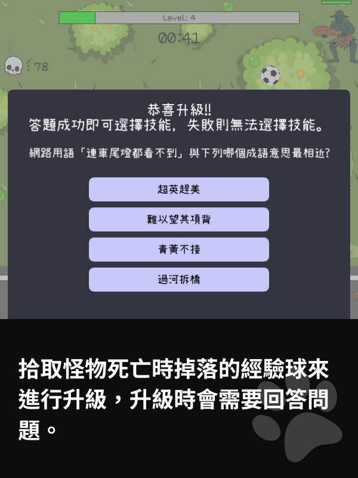
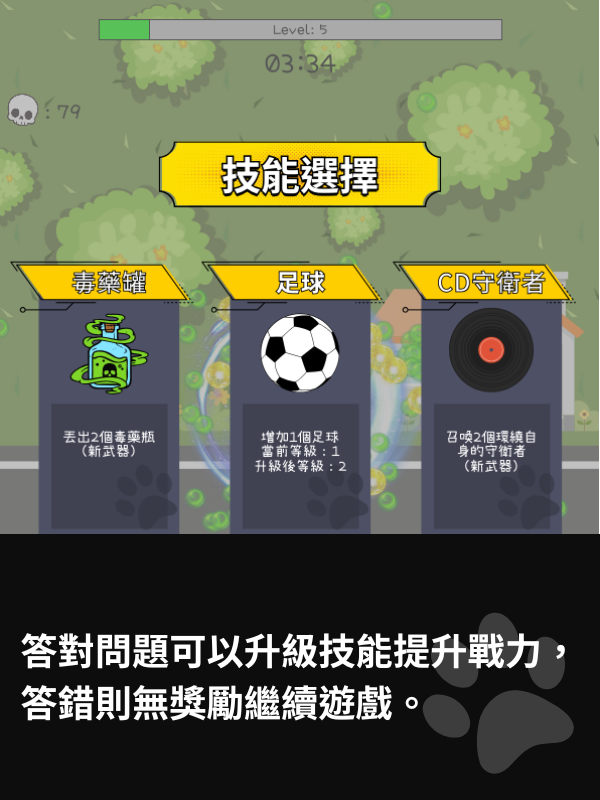

# 🕵️‍♂️ 貓貓特工 (Meow Agent)

《貓貓特工》是一款結合**射擊**與**學科教育**的趣味小遊戲！  
玩家將扮演**貓咪特工**，一邊與敵人戰鬥，一邊完成隨機生成的學科題目。答對題目即可獲得技能強化，讓角色變得更強！

**靈感來源**：類似《達達特工》的動作射擊遊戲，我們希望透過 **寓教於樂** 的方式，讓學習變得更加有趣！📚🎮

---

## **✨ 遊戲特色**
- **🎲 隨機題目挑戰**：每場遊戲的學科問題都不同，保持新鮮感！
- **⚡ 技能強化系統**：答對題目後可升級武器技能，提高戰鬥能力！
- **📚 多學科內容**：涵蓋數學、科學、語文等不同知識，邊玩邊學！
- **🎮 角色成長系統**：敵人越來越強，玩家需要用戰略與知識生存下去！

---

## **🎯 遊戲玩法**
1. **控制特工角色**，在場景中移動並擊敗敵人。
2. **隨機學科題目**會出現在畫面上，答對可獲得能力提升！
3. **不同技能與道具**，幫助你在戰場上生存更久！
4. **挑戰 Boss 階段**，擊敗強大敵人，獲得更高分數！

---

## **📸 遊戲畫面**
<p align="center">
  
  
</p>
<p align="center">
  
  
</p>

---

## **🎥 遊戲遊玩展示影片**
點擊圖片可以前往 youtube 觀看
[](https://youtu.be/gtMC3hjhFL8)

---

## **💻 安裝與執行**
### **📌 系統需求**
- **操作系統**：Windows, macOS 或 Linux
- **軟體需求**：Processing IDE（[下載 Processing](https://processing.org/download/)）

### **🚀 安裝步驟**
1. **下載專案**
   ```bash
   git clone https://github.com/Eason20050201/Meow-Agent.git
   ```
2. **開啟 Processing IDE，打開 `Main.pde`。**

3. **安裝 `ddf.minim` 音訊庫**：
   - **步驟 1**：打開 Processing IDE → 點擊 **Sketch > Import Library > Add Library**。
   - **步驟 2**：搜尋 `Minim`，然後點擊**安裝**。
   - **步驟 3**：確認安裝成功：在 **Sketch > Import Library** 中應該能看到 `Minim`。

4. **點擊 "播放按鈕"，啟動遊戲！** 🚀

---

## **🔧 需要改進的地方**
✅ **性能優化**：遊戲時間過長時，Processing 可能會有**卡頓問題**。  
🛠 **解決方案**：考慮改用 **Unity 或 Godot** 開發，提升效能。  

✅ **遊戲內容新增**：  
- 增加 **商店系統**（可購買技能與裝備）。  
- 角色選擇功能，讓玩家可以切換不同貓咪角色！  

---

## **👥 團隊分工**
| 開發者 | 主要貢獻 |
|--------|----------|
| **王翊鑫 (45%)** | 🔹 主角移動 & 物理系統<br>🔹 技能升級系統<br>🔹 敵人 AI & Boss 系統<br>🔹 音效設計 & 碰撞處理 |
| **林楷杰 (55%)** | 🔹 遊戲 UI & 角色美術<br>🔹 武器技能設計 & 動畫<br>🔹 題目系統 & 關卡設計<br>🔹 主畫面 & 互動介面 |

---

## **📜 授權 & 版權**
- **程式碼** 遵循 **MIT License**，可自由修改與使用。
- **遊戲圖片** 使用 **Canva** 製作，版權歸原作者所有。
- **音效** 來自網路公開資源，版權歸原創作者所有。

---

## **📬 聯絡方式**
📌 GitHub Issues: [開 Issue 聯絡我們](https://github.com/Eason20050201/Meow-Agent/issues)

---
