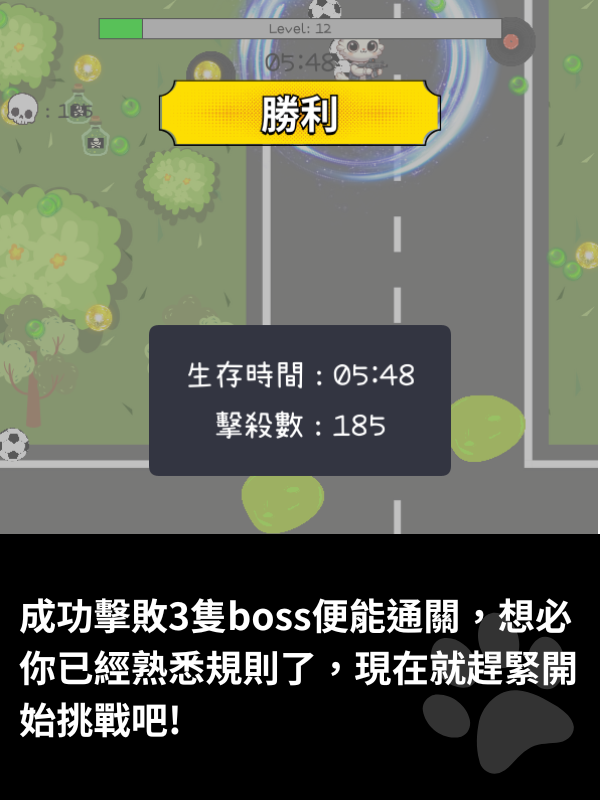

# 貓貓特工 (Meow Agent)

《貓貓特工》是一款結合射擊與學科教育的趣味小遊戲，讓玩家在戰鬥冒險中學習知識。靈感來自《達達特工》這類動作遊戲，我們希望通過寓教於樂的方式，讓學習變得更加有趣！

---

## 遊戲簡介
玩家扮演一位貓咪特工，挑戰源源不斷的敵人，同時完成隨機生成的教育題目。成功解題後可獲得技能強化或新技能，進一步提升角色的攻擊、速度等能力。

### 遊戲特色
- **隨機題型**：每次生成不同的學科問題，保持新鮮感並提升學習效率。
- **角色成長系統**：解題成功可強化角色技能，使角色逐步變強。
- **多學科挑戰**：涵蓋數學、科學、語文等多學科內容，讓玩家在遊戲中不斷增長知識。

---

## 遊戲玩法
1. 玩家需要控制特工角色，通過戰鬥消滅敵人。
2. 每個關卡將隨機產生教育問題，答對後可獲得強化技能或解鎖新能力。
3. 玩家需利用技能升級與戰鬥策略完成冒險，擊敗更多敵人。

---

## 實機展示
### 遊戲畫面





### 遊戲遊玩畫面
[👉 點擊查看遊戲影片](https://drive.google.com/file/d/1Yfvv6c2nfVeTj7cJCWrnY85BA3G2mbdY/view?usp=drive_link)

---

## 安裝與執行
### 系統需求
- **操作系統**：Windows, macOS 或 Linux
- **軟體需求**：Processing IDE（[下載 Processing](https://processing.org/download/)）

### 運行步驟

1. **下載此專案：**

   ```bash
   git clone git@github.com:yourusername/meow-agent.git
   ```

2. **開啟 Processing IDE，打開專案中的 Main.pde。**

3. **另外下載 ddf.minim（音訊處理庫）**

   **下載與安裝步驟：**

   a. **打開 Processing 的庫管理器：**
      - 在 Processing IDE 中，點擊 **Sketch > Import Library > Add Library**。

   b. **搜尋 Minim：**
      - 在搜尋欄輸入 Minim。

   c. **安裝 Minim 庫：**
      - 找到 Minim 音訊處理庫，然後點擊 **安裝**。

   d. **確認安裝成功：**
      - 安裝後，您可以通過 **Sketch > Import Library** 查看是否有 Minim 選項。
      - 如果選項存在，說明安裝成功。

4. **點擊 Processing IDE 的 "播放按鈕"，啟動遊戲。**


---

## 待改進的地方
1. **性能優化**：
   - 由於 Processing 的性能表現，我們認為在遊玩一段時間後，因為怪物圖片太多，導致遊玩會有卡頓。
   - 解決方法：考慮切換至其他語言（如 Unity 或 Godot）。

2. **新增系統**：
   - 可以考慮加入商店系統與角色選擇功能。

---

## 團隊分工
#### 王翊鑫（45% 貢獻）：
- **主角移動**  
  - 主角的座標、移動速度、加速度、最大速度和摩擦力等，使主角能在地圖中絲滑地移動。
- **主角升級系統**  
  - 當前等級顯示、等級機制、選擇武器技能介面。
- **武器技能升級系統**  
  - 判定目前武器技能等級、傷害提升等。
  - 選單中顯示當前所持有的武器技能等級。
- **武器技能調整**
  - 毒藥拋物線調整
  - 閃電打擊範圍調整
- **邊界與碰撞處理**  
  - 收集能量、角色與敵人碰撞、子彈與敵人/主角碰撞等。
- **敵人系統**
  - 敵人生成
  - 敵人各自擁有不同的血量、攻擊方式（如發射子彈、毒網等）、移動與顯示特效，擊敗後掉落不同顏色的經驗道具。
- **Boss 階段**  
  - 切換到 Boss 階段，會清除小怪並生成特定的 Boss。  
  - 播放警報音效。  
  - Boss 擁有更高的血量與特殊攻擊方式，帶有高額傷害。  
  - Boss 被擊敗後，給予玩家大量能量（Boss 敵人的掉落邏輯），並結束 Boss 階段，恢復小怪生成。
- **勝負判斷與畫面**
- **遊戲時間處理**
  - 暫停處理
  - boss 出現時間
- **遊戲音效**
  - 武器技能音效
  - 主角受傷音效
  - 點擊音效
  - 背景樂
  - 勝負音效
  - Boss 音效
  
#### 林楷杰（55% 貢獻）：
- **遊戲中所有圖片**  
  - 主角、敵人、能量道具、子彈道具、武器技能、場景、選單等。
- **遊戲說明介面**
- **主角動畫**  
  - 根據角色當前速度切換站立或行走圖片，並依照角色的面向方向進行翻轉顯示。
- **武器技能的動畫**
  - 能量力場
  - 守衛者（旋轉）
  - 足球
  - 閃電
  - 毒藥
- **答題系統**
  - 題目製作
  - 對錯判定
  - 答題介面**  
- **關卡的等級系統**  
  - 根據玩家所玩的關卡而有不同的敵人、敵人移動速度/傷害/血量。
- **Boss 階段**  
  - 出現警示效果動畫。
- **遊戲大廳介面系統**  
  - 顯示不同關卡的背景與解鎖/鎖定狀態。  
  - 關卡的選擇與切換功能。  
  - 提供選項：開始遊戲、繼續遊戲、關於、離開。  
  - 設計按鈕的互動效果（如按鈕點擊時的動畫）
- **遊戲選單**
  - 回主畫面
  - 暫停功能
  - 靜音功能
- **遊戲音效**
  - 怪物死亡音效
  - 題目正確/錯誤音效

---
